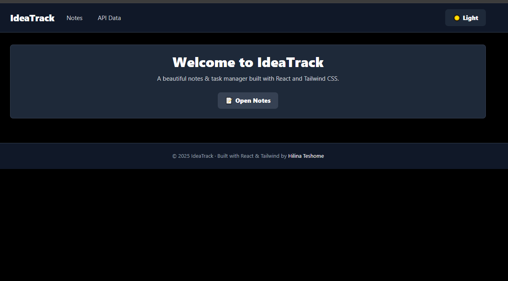
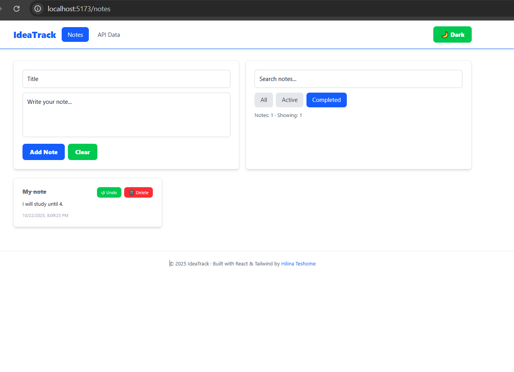
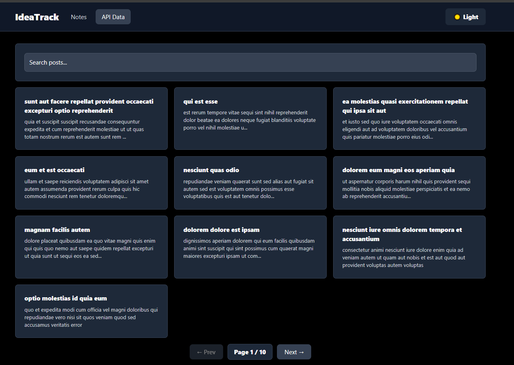

# IdeaTrack - Notes & Task Manager

A modern, responsive notes and task management application built with React, Tailwind CSS, and Vite. Features a beautiful dark/light mode toggle and clean user interface.

## 📸 Screenshots

### Light Mode


### Dark Mode


### Notes Page


### API Integration


## ✨ Features

- **Dark/Light Mode Toggle** - Seamless theme switching with persistence across sessions
- **Responsive Design** - Works perfectly on desktop, tablet, and mobile devices
- **Notes Management** - Create, edit, and manage your notes efficiently
- **API Integration** - Fetch and display external data
- **Modern UI** - Built with Tailwind CSS for a clean, professional look
- **Fast Performance** - Powered by Vite for lightning-fast development and builds
- **Local Storage** - Automatic saving of user preferences

## 🚀 Technologies Used

- **React 19** - Modern React with hooks
- **Tailwind CSS v4** - Utility-first CSS framework
- **React Router** - Client-side routing
- **Vite** - Next-generation frontend tooling
- **LocalStorage API** - For data persistence

## 📋 Prerequisites

Before you begin, ensure you have the following installed:
- Node.js (v16 or higher)
- npm or yarn

## 🛠️ Installation

1. Clone the repository
```bash
git clone https://github.com/PLP-MERN-Stack-Development/react-js-jsx-and-css-mastering-front-end-development-linat117.git
cd IdeaTrack
```

2. Install dependencies
```bash
npm install
```

3. Start the development server
```bash
npm run dev
```

4. Open your browser and navigate to `http://localhost:5173`

## 📦 Build for Production

To create a production build:

```bash
npm run build
```

To preview the production build:

```bash
npm run preview
```

## 🎨 Project Structure

```
IdeaTrack/
├── src/
│   ├── components/
│   │   ├── Button.jsx
│   │   ├── Card.jsx
│   │   ├── Footer.jsx
│   │   ├── Layout.jsx
│   │   └── Navbar.jsx
│   ├── context/
│   │   └── ThemeContext.jsx
│   ├── hooks/
│   │   └── useLocalStorage.js
│   ├── pages/
│   │   ├── API.jsx
│   │   ├── Home.jsx
│   │   └── Notes.jsx
│   ├── App.jsx
│   ├── App.css
│   ├── index.css
│   └── main.jsx
├── index.html
├── package.json
└── vite.config.js
```

## 🎯 Features in Detail

### Theme Management
The application includes a sophisticated dark/light mode implementation that:
- Persists user preference in localStorage
- Applies theme instantly on page load (no flash)
- Smoothly transitions between themes
- Affects all UI components consistently

### Responsive Navigation
- Mobile-friendly hamburger menu
- Smooth transitions and hover effects
- Active route highlighting

### Reusable Components
- Button component with multiple variants
- Card component for content display
- Layout wrapper for consistent page structure

## 🤝 Contributing

Contributions are welcome! Feel free to submit issues and pull requests.

## 📄 License

This project is open source and available under the MIT License.

## 👤 Author

Your Name

## 🙏 Acknowledgments

- Tailwind CSS for the amazing utility-first CSS framework
- React team for the powerful UI library
- Vite team for the blazing fast build tool
